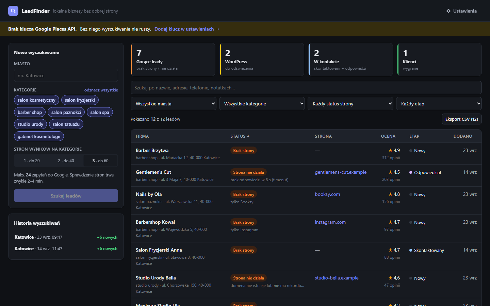
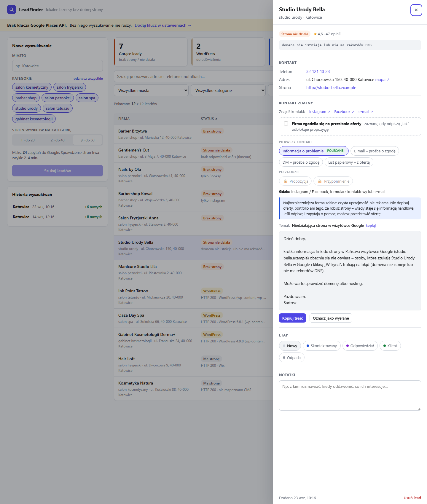

# LeadFinder

Lokalna aplikacja webowa (ASP.NET Core 8 + React), która wyszukuje biznesy usługowe (salony beauty,
fryzjerów, barberów, salony paznokci, spa, studia tatuażu…) w podanym mieście przez
**Google Places API (New)**, sprawdza ich strony WWW i pomaga prowadzić kontakt z potencjalnymi klientami.



- **Wyszukiwanie z postępem na żywo:** miasto, całe województwo albo cała Polska (miasto po mieście, z progiem
  szansy, np. tylko leady 65+). Postęp przychodzi przez Server-Sent Events, a przy skanie wielu miast wyniki
  zapisują się po każdym mieście.
- **Licznik darmowego limitu Google:** ile zapytań zostało w tym miesiącu, szacunek kosztu przed startem i blokada
  skanu, który przekroczyłby limit bez Twojego potwierdzenia.
- **Klasyfikacja leadów:** brak strony, strona nie działa, WordPress do odświeżenia, ma stronę.
- **Szansa na zlecenie 0–100** z uzasadnieniem: stan strony (także brak wersji na telefon i stara stopka),
  ruch w salonie, ocena i branża. Lista jest posortowana od najlepszych leadów.
- **Mini-CRM z zakładkami:** Nowe · W kontakcie · Na później · Klienci · Odrzucone · Wszystkie. Zmiana etapu przenosi
  salon do innej zakładki, więc lista „Nowe” maleje w miarę pracy. Notatki zapisują się automatycznie.
- **Przypomnienia „następny krok”:** data przy leadzie, kafelek „Do zrobienia” z dzisiejszymi i zaległymi sprawami.
  Po wysłaniu propozycji przypomnienie za tydzień ustawia się samo.
- **Filtry wielokrotnego wyboru** (kilka miast i kategorii naraz). Filtry i sortowanie są zapamiętywane
  między uruchomieniami.
- **Pamięć między wyszukiwaniami:** ponowne przeszukanie miasta pokazuje, które firmy są nowe.
  Twoje etapy i notatki nie są nadpisywane.
- **Kontakt zdalny zgodny z przepisami:** kilka wersji wiadomości (informacja o problemie, DM, e-mail, list papierowy,
  propozycja po zgodzie), rejestr zgód i lista sprzeciwów. Barber na „Ty”, spa na „Państwo”. **Bez automatycznej wysyłki.**
- **Eksport do CSV** gotowego do otwarcia w polskim Excelu.



Aplikacja działa **wyłącznie na Twoim komputerze** (`localhost`). Klucz API i baza leadów nie trafiają na żaden serwer.

## Uruchomienie

Wymagania: [.NET 8 SDK](https://dotnet.microsoft.com/download/dotnet/8.0) i [Node.js 20.19+](https://nodejs.org/)
(Node służy tylko do zbudowania frontendu).

**Dwuklik na `LeadFinder.cmd`**, albo w terminalu:

```powershell
dotnet run --project src\LeadFinder.Web
```

Przeglądarka otworzy się sama na http://localhost:5178. Pierwsze uruchomienie trwa 1–2 minuty, bo instaluje
zależności frontendu. Aplikację wyłączasz, zamykając okno konsoli.

Możesz też zainstalować LeadFindera jak aplikację, z osobnym oknem i ikoną na pasku zadań.
W Edge wybierz *menu … → Aplikacje → Zainstaluj tę witrynę jako aplikację*, a w Chrome ikonę instalacji w pasku adresu.

Przy pierwszym wejściu kliknij **Ustawienia**, wklej klucz API i wpisz swoje imię oraz podpis do szkiców.
Klucz jest od razu sprawdzany zapytaniem, które według cennika Google jest bezpłatne.

### Tryb demo (bez klucza API)

```powershell
dotnet run --project src\LeadFinder.Web --launch-profile Demo
```

Przykładowe, fikcyjne dane w osobnej bazie. Przydatne, żeby obejrzeć aplikację albo zrobić zrzuty ekranu.

### Wersja do uruchamiania dwuklikiem (bez SDK)

```powershell
.\publish.ps1
```

Tworzy `dist\LeadFinder.Web.exe`. Na docelowym komputerze wystarczy
[.NET 8 Runtime (ASP.NET Core)](https://dotnet.microsoft.com/download/dotnet/8.0). Folder `dist` można przenieść
w dowolne miejsce i zrobić skrót na pulpicie.

## Jak zdobyć klucz API

1. Wejdź na [Google Cloud Console](https://console.cloud.google.com/) i utwórz projekt.
2. Podepnij konto rozliczeniowe (**Billing**). Google wymaga karty nawet przy darmowym limicie.
3. **APIs & Services → Library** → włącz **Places API (New)**. To nie jest stare „Places API”.
4. **APIs & Services → Credentials → Create credentials → API key**.
5. Ogranicz klucz: *API restrictions → Restrict key → Places API (New)*.
6. Wklej klucz w **Ustawieniach** aplikacji.

Alternatywnie klucz może być w zmiennej środowiskowej `GOOGLE_PLACES_API_KEY` albo w pliku `.env`
(wzór: `.env.example`): `src\LeadFinder.Web\.env` przy `dotnet run`, `dist\.env` w wersji opublikowanej.
Taki klucz ma pierwszeństwo przed kluczem z ustawień.

## Ile to kosztuje

Każda **strona wyników** Text Search to jedno płatne zapytanie. Maksymalny koszt jednego wyszukiwania:

```
liczba kategorii × liczba stron = 8 × 3 = 24 zapytania na miasto
```

Formularz pokazuje tę liczbę przed startem. Google zwraca maksymalnie 60 wyników (3 strony) na frazę.

**Skan województwa lub Polski** to miasta × kategorie × strony, np. śląskie (30 miast) × 8 × 3 = do 720 zapytań.
Lista miast jest w [src/LeadFinder.Core/Config/regions.json](src/LeadFinder.Core/Config/regions.json). Aplikacja
**liczy wysłane płatne zapytania** i pokazuje, ile zostało z darmowego limitu (domyślnie 1000, do zmiany w
Ustawieniach). Skan, który mógłby go przekroczyć, wymaga potwierdzenia. Licznik obejmuje tylko zapytania z tej
aplikacji. Pełne zużycie klucza zobaczysz w Google Cloud Console.

Od marca 2025 Google Maps Platform zamiast kredytu 200 USD daje **darmowe limity miesięczne na każdą
usługę (SKU)**. Przykładowe limity to 5 000 zapytań Text Search Pro i 10 000 Place Details Essentials
miesięcznie. LeadFinder nie używa Place Details, bo wszystkie potrzebne pola pobiera w samym Text Search.

> ⚠️ **Na co uważać: FieldMask decyduje o cenie.**
> Pola `websiteUri`, `nationalPhoneNumber`, `rating` i `userRatingCount` należą do SKU
> **Text Search Enterprise**, a nie Pro. W chwili pisania Enterprise miało **1 000 darmowych zapytań
> miesięcznie**, potem około 35 USD za 1000. Przy 24 zapytaniach na miasto to około 40 pełnych
> wyszukiwań miesięcznie za darmo. Później jedno miasto kosztuje mniej niż 1 USD.
> Aktualne stawki: [cennik Google Maps Platform](https://developers.google.com/maps/billing-and-pricing/pricing).

Jedno miasto raz na jakiś czas mieści się w darmowym limicie. Przy wielu miastach i kategoriach koszty mogą urosnąć. Dlatego:

1. Ustaw **budżet z alertem**: [Google Cloud Console → Billing → Budgets & alerts](https://console.cloud.google.com/billing/budgets).
   Budżet tylko **powiadamia**, sam nie blokuje wydatków.
2. Żeby **twardo ograniczyć** koszty, ustaw limit dzienny w
   *APIs & Services → Places API (New) → Quotas* (np. 200 zapytań dziennie).

## ⚖️ Kontakt zdalny i przepisy

Aplikacja **celowo nie wysyła** żadnych wiadomości. Nie ma w niej integracji z mailem, SMS-ami, komunikatorami
ani narzędziami do mass-mailingu. Przygotowuje teksty i prowadzi przez proces, a wysyłasz ręcznie.

**Dlaczego tak:** niezamówiona informacja handlowa drogą elektroniczną jest zakazana przez *ustawę o świadczeniu usług
drogą elektroniczną* (art. 10). Marketing bezpośredni przez telefon, SMS, e-mail i komunikatory bez wcześniejszej zgody
zakazuje też *Prawo komunikacji elektronicznej* (art. 398). Dotyczy to również firm i wiadomości pisanych ręcznie.

**Proces w aplikacji** (panel „Kontakt zdalny” przy każdym leadzie):

| Krok | Wersja wiadomości | Uwagi |
|---|---|---|
| Pierwszy kontakt | **Informacja o problemie** (tylko „strona nie działa”) | Sama uprzejmość, bez oferty. Najniższe ryzyko z opcji elektronicznych. Często to firma pyta wtedy o pomoc. |
| | **DM – prośba o zgodę** (Instagram / Facebook) | Salony beauty najszybciej odpowiadają na IG. Tylko pytanie o zgodę, bez cen i opisu usług. |
| | **E-mail – prośba o zgodę** | Jak DM, plus temat i informacja, skąd masz kontakt. |
| | **List papierowy – z ofertą** | Nie jest komunikacją elektroniczną, więc zakazy z UŚUDE i PKE go nie obejmują. Może zawierać ofertę. Ma klauzulę RODO (art. 14) i przycisk „Drukuj”. |
| Po zgodzie | **Propozycja**, potem jedno **przypomnienie** | Odblokowane dopiero po zaznaczeniu „Firma zgodziła się na przesłanie oferty”. Data zgody zapisuje się jako dowód. |

- **Znajdź kontakt:** linki do wyszukania profilu firmy na Instagramie, Facebooku i jej adresu e-mail.
- **„Oznacz jako wysłane”** dopisuje do notatek datę i rodzaj wiadomości, a etap zmienia na „Skontaktowany”.
- **Brak odpowiedzi traktuj jako „nie”.** Nie ponawiaj prośby o zgodę.
- **Sprzeciw:** „Usuń lead → Usuń i nie pokazuj więcej” kasuje dane firmy i zapamiętuje tylko jej identyfikator Google,
  żeby nie wróciła przy kolejnym wyszukiwaniu (RODO art. 21).
- Dane jednoosobowych działalności to dane osobowe. Baza leży lokalnie w `%LOCALAPPDATA%\LeadFinder`.
  W Ustawieniach uzupełnij e-mail i adres, bo trafiają do klauzuli informacyjnej w listach.

Prośba o zgodę wysłana e-mailem lub przez DM to według części interpretacji nadal szara strefa. List papierowy
i informacja o problemie bez oferty niosą najmniejsze ryzyko. To nie jest porada prawna.

## Klasyfikacja leadów

| Status | Kiedy |
|---|---|
| **Brak strony** (gorący) | brak strony w Google albo zamiast strony profil Booksy / Facebook / Instagram |
| **Strona nie działa** (gorący) | timeout 8 s, błąd DNS, błąd certyfikatu SSL, kod HTTP ≠ 2xx |
| **WordPress** | strona działa i ma ślady WordPressa (`wp-content`, `wp-includes`, `wp-json`); wersja z meta generator, jeśli jest |
| **Ma stronę** | pozostałe; w notatce rozpoznany kreator (Wix, Squarespace, Shopify…) |

Kod 403/429 często oznacza ochronę przed botami (np. Cloudflare), a nie martwą stronę.
Notatka przy leadzie podpowiada wtedy, żeby sprawdzić stronę ręcznie.

## Szansa na zlecenie (0–100)

Każdy lead dostaje szacunek, jak duża jest szansa, że firma zechce nową stronę. Lista jest domyślnie
posortowana od największej szansy, a w szczegółach leada widać, z czego wziął się wynik (np. „+45 strona nie działa”).
To heurystyka z jawnych sygnałów, a nie pewność. Wagi są w jednym pliku,
[LeadScorer.cs](src/LeadFinder.Core/Services/LeadScorer.cs), i warto je poprawiać, gdy zobaczysz, kto faktycznie odpowiada.

| Grupa | Sygnały | Punkty |
|---|---|---|
| **Potrzeba** | strona nie działa · tylko Booksy · tylko profil IG/FB · brak strony · WordPress | 45 · 42 · 38 · 35 · 20 |
| | stary WordPress (< 6) · brak wersji na telefon · stopka sprzed 3+ lat · brak HTTPS | +10 · +15 · +8 · +7 |
| **Możliwości** | liczba opinii: 200+ · 80+ · 30+ · 10+ | 20 · 16 · 12 · 6 |
| | ocena: 4,7+ · 4,3+ · poniżej 4,0 | +8 · +4 · −5 |
| **Branża** | spa / kosmetologia · fryzjer / kosmetyczka / tatuaż · barber / paznokcie | 8 · 5 · 3 |
| **Inne** | brak telefonu · tymczasowo zamknięta · zamknięta na stałe | −5 · −20 · wynik 0 |

Poziomy: **65+ wysoka**, **40–64 średnia**, **poniżej 40 niska**. Sygnały strony (telefon, stopka, HTTPS) i status firmy
z Google są zbierane przy wyszukiwaniu, więc leady znalezione wcześniej dostaną je po ponownym przeszukaniu miasta.

## Kategorie

Lista jest w [src/LeadFinder.Core/Config/categories.json](src/LeadFinder.Core/Config/categories.json).
Nowa kategoria to nowy obiekt, bez zmian w kodzie:

```json
{ "id": "masaz", "query": "gabinet masażu", "englishName": "massage studio", "aliases": ["masaż"], "tone": "spa" }
```

`tone` wybiera ton wiadomości: `barber`, `hair`, `beauty`, `nails`, `spa`, `tattoo`, `cosmetology`.
Nieznany ton daje neutralny szablon. W wersji z `dist\` plik leży w `dist\Config\`.

## CLI

Wersja konsolowa korzysta z tego samego rdzenia i zapisuje wynik od razu do CSV:

```powershell
cd src\LeadFinder.Cli
dotnet run -- --city "Katowice" --categories "fryzjer,barber" --pages 2
dotnet run -- --help
```

Klucz czyta ze zmiennej `GOOGLE_PLACES_API_KEY` albo z `.env` w katalogu roboczym.
Kody wyjścia: `0` sukces, `1` błąd API lub konfiguracji, `2` złe argumenty, `130` Ctrl+C.

## CSV i Excel

- **UTF-8 z BOM**: bez BOM Excel psuje polskie znaki.
- **Separator `;`**: przy polskich ustawieniach regionalnych Excel dzieli kolumny średnikiem.
- **Ocena z przecinkiem (`4,7`)**: `4.7` Excel zamieniłby na datę.
- Pola zaczynające się od `=`, `+`, `-`, `@` dostają prefiks `'` (ochrona przed CSV injection).

Kolumny: `Nazwa; Kategoria; Adres; Telefon; Strona; Status; Szansa; Technologia; Ocena; LiczbaOpinii; SzkicWiadomosci`.

## Architektura

```
src/
├─ LeadFinder.Core/          logika domenowa, bez zależności od UI
│  ├─ Models/                Place, Category, Lead, LeadStatus, WebsiteCheckResult, SearchProgress
│  ├─ Services/              PlacesApiClient, WebsiteChecker, TechnologyDetector, LeadClassifier,
│  │                         MessageDrafter, CsvExporter, LeadSearchPipeline
│  └─ Config/                categories.json, CategoryCatalog, EnvFileLoader
├─ LeadFinder.Cli/           aplikacja konsolowa: argv → pipeline → CSV
└─ LeadFinder.Web/           ASP.NET Core Minimal API + SQLite (EF Core)
   ├─ Endpoints/             /api/leads, /api/searches (+ SSE), /api/settings
   ├─ Search/                SearchJobRunner (wyszukiwanie w tle), SearchJob (rozgłaszanie postępu)
   ├─ Data/                  DbContext, encje, migracje, LeadStore (upsert po place.id)
   └─ ClientApp/             React 19 + TypeScript + Vite (build do wwwroot/)
```

Przepływ wyszukiwania:

```
POST /api/searches → SearchJobRunner (Task w tle, jedno wyszukiwanie naraz)
  → LeadSearchPipeline (Core): Google Places → deduplikacja → WebsiteChecker (300 ms przerwy)
      └─ IProgress<SearchProgress> → SearchJob → SSE → pasek postępu w React
  → LeadStore: nowe leady dodane, istniejące odświeżone (etap i notatki zostają)
```

Decyzje projektowe:

- **Core bez zależności.** Pipeline raportuje postęp przez `IProgress<T>`, a zapis wyniku należy do
  wywołującego: CLI zapisuje CSV, Web zapisuje do bazy. Ten sam kod obsługuje obie aplikacje.
- **Szkice generowane przy odczycie.** Nie są zapisywane w bazie, więc zmiana podpisu w ustawieniach
  od razu obejmuje wszystkie leady.
- **SSE zamiast WebSocketów.** Komunikacja jest jednokierunkowa, a `EventSource` jest wbudowany w przeglądarkę.
  Po odświeżeniu strony serwer odtwarza historię zdarzeń, więc zamknięcie karty nie przerywa wyszukiwania.
- **Filtrowanie po stronie przeglądarki.** Przy kilku tysiącach leadów jest natychmiastowe i prostsze niż paginacja API.
- **Bezpieczeństwo lokalne.** Serwer nasłuchuje tylko na `localhost`, a `AllowedHosts` blokuje ataki DNS rebinding.
  Endpointy wymagają JSON, więc obca strona nie wyśle do nich formularza.
- **Zależności:** EF Core Sqlite po stronie .NET. React i Vite po stronie frontendu, bez bibliotek UI.

### Praca nad frontendem

```powershell
dotnet run --project src\LeadFinder.Web --launch-profile Dev   # API na :5178
cd src\LeadFinder.Web\ClientApp; npm run dev                    # Vite z HMR na :5173
```

Migracje bazy: `dotnet ef migrations add <Nazwa> -p src\LeadFinder.Web -o Data/Migrations`
(narzędzie jest w lokalnym manifeście, `dotnet tool restore`).
